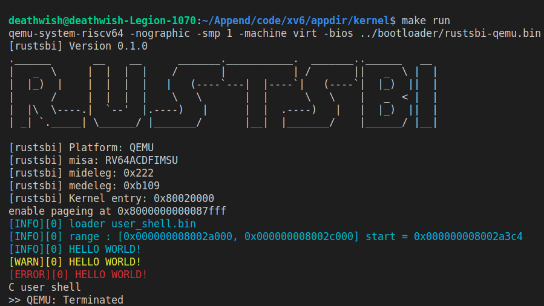

# lab1 实验要求

- 本节难度：**低**

## 编程作业

lab1 的工作使得我们从硬件世界跳入了软件世界，当看到自己的小 os 可以在裸机硬件上输出 `hello world` 是不是很高兴呢？但是为了后续的一步开发，更好的调试环境也是必不可少的，第一章的练习要求大家实现更加炫酷的彩色log。

详细的原理不多说，感兴趣的同学可以参考 [ANSI转义序列](https://zh.wikipedia.org/wiki/ANSI%E8%BD%AC%E4%B9%89%E5%BA%8F%E5%88%97)，现在执行如下这条命令试试

```console
   $ echo -e "\x1b[31mhello world\x1b[0m"
```

如果你明白了我们是如何利用串口实现输出，那么要实现彩色输出就十分容易了，只需要用需要输出的字符串替换上一条命令中的 `hello world`，用期望颜色替换 `31` (代表红色)即可。

我们推荐实现如下几个等级的输出，输出优先级依次降低：

| 名称  |   颜色   |                     用途                     |
| :---: | :------: | :------------------------------------------: |
| ERROR | 红色(31) | 表示发生严重错误，很可能或者已经导致程序崩溃 |
| WARN  | 黄色(93) | 表示发生不常见情况，但是并不一定导致系统错误 |
| INFO  | 蓝色(34) | 比较中庸的选项，输出比较重要的信息，比较常用 |
| DEBUG | 绿色(32) |        输出信息较多，在 debug 时使用         |
| TRACE | 灰色(90) |   最详细的输出，跟踪了每一步关键路径的执行   |


我们要求输出设定输出等级以及更高输出等级的信息，如设置 `LOG = INFO`，则输出　`ERROR`、`WARN`、`INFO` 等级的信息。简单 demo 如下，输出等级为 INFO:



为了方便使用彩色输出，我们要求同学们实现彩色输出的宏或者函数，用以代替 print 完成输出内核信息的功能，它们有着和 prinf 十分相似的使用格式，要求支持可变参数解析，形如：
```rust
    // 这段代码输出了 os 内存空间布局，这到这些信息对于编写 os 十分重要
    　
    info!(".text [{:#x}, {:#x})", stext as usize, etext as usize);
    debug!(".rodata [{:#x}, {:#x})", srodata as usize, erodata as usize);
    error!(".data [{:#x}, {:#x})", sdata as usize, edata as usize);
```
``` c
    info("load range : [%d, %d] start = %d\n", s, e, start);
```

在以后，我们还可以在 log 信息中增加线程、CPU等信息（只是一个推荐，不做要求），这些信息将极大的方便你的代码调试。


### 编程实验要求
- 实现分支：ch1。
- 完成实验指导书中的内容，在裸机上实现 `hello world` 输出。
- 实现彩色输出宏
- 利用彩色输出宏输出 os 内存空间布局，即：输出 `.text`、`.data`、`.rodata`、`.bss` 各段位置，输出等级为 `INFO`。

challenge:实现多核 boot。

### 实验检查

- 实验目录要求(C)

```
   ├── os(内核实现)
   │   ├── Makefile (要求 make run LOG=xxx 可以正确执行)
   │   └── ...
   ├── reports(报告)
   │   ├── lab1.md/pdf
   │   └── ...
   ├── README.md（其他必要的说明）
   ├── ...
```

报告命名 labx.md/pdf，统一放在 reports 目录下。每个实验新增一个报告，为了方便修改，检查报告是以最新分支的所有报告为准。

- 检查

```console
   $ cd os
   $ git checkout ch1
   $ make run LOG=INFO
```
可以正确执行(可以不支持LOG参数，而是设置默认log等级)，可以看到正确的内存布局输出，根据实现不同数值可能有差异，但应该位于 ``linker.ld`` 中指示 ``BASE_ADDRESS`` 后一段内存，输出之后关机。

### tips

- 对于 Rust, 可以使用 crate `log`，推荐参考 [rCore](https://github.com/rcore-os/rCore/blob/master/kernel/src/logging.rs)
- 对于 C，可以实现不同的函数（注意不推荐多层可变参数解析，有时会出现不稳定情况），也可以参考 [linux printk](https://github.com/torvalds/linux/blob/master/include/linux/printk.h#L312-L385) 使用宏实现代码重用。
- 两种语言都可以使用 `extern` 关键字获得在其他文件中定义的符号。

## 问答作业

1. 为了方便 os 处理，Ｍ态软件会将 S 态异常/中断委托给 S 态软件，请指出有哪些寄存器记录了委托信息，rustsbi 委托了哪些异常/中断？（也可以直接给出寄存器的值）

2. 请学习 gdb 调试工具的使用(这对后续调试很重要)，并通过 gdb 简单跟踪从机器加电到跳转到 0x80200000 的简单过程。只需要描述重要的跳转即可，只需要描述在 qemu 上的情况。

    tips: 
    * 事实上进入 rustsbi 之后就不需要使用 gdb 调试了。可以直接阅读代码。[rustsbi起始代码](https://github.com/luojia65/rustsbi/blob/master/platform/qemu/src/main.rs#L93)
    * 可以使用示例代码 Makefile 中的 `make debug` 指令。

    * 一些可能用到的 gdb 指令：
        * `x/10i 0x80000000` : 显示 0x80000000 处的10条汇编指令。
        * `x/10i $pc` : 显示即将执行的10条汇编指令。
        * `x/10xw 0x80000000` : 显示 0x80000000 处的10条数据，格式为16进制32bit。
        * `info register`: 显示当前所有寄存器信息。
        * `info r t0`: 显示 t0 寄存器的值。
        * `break funcname`: 在目标函数第一条指令处设置断点。
        * `break *0x80200000`: 在 0x80200000 出设置断点。
        * `continue`: 执行直到碰到断点。
        * `si`: 单步执行一条汇编指令。

## 报告要求

* 简单总结本次实验你编程的内容。（控制在5行以内，不要贴代码）
* 由于彩色输出不好自动测试，请附正确运行后的截图。
* 完成问答问题。
* (optional) 你对本次实验设计及难度的看法。